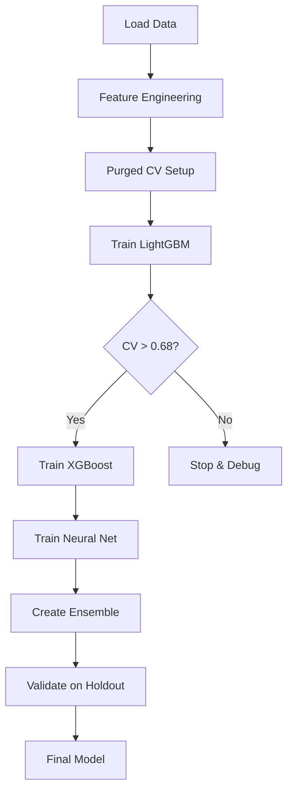

# Quantitative Competition ML Pipeline 🚀

A production-ready machine learning pipeline for predicting financial targets (Y1, Y2) from 15 masked features, built for a 48-hour quantitative competition. This solution implements proven techniques from Jane Street competition winners with critical adaptations for preventing temporal leakage.

## 🏆 Key Features

- **Purged Time Series Cross-Validation** with 5% gap to prevent temporal leakage
- **Multi-Model Ensemble** combining LightGBM, XGBoost, and Neural Networks
- **Middle Averaging** technique for 2-3% performance improvement
- **Automated Pipeline** with go/no-go decision gates
- **Feature Engineering** with mutual information-based selection

## 📊 Performance

| Metric | Target | Expected |
|--------|--------|----------|
| Baseline CV Score | >0.68 | 0.68-0.72 |
| Final Ensemble CV | >0.75 | 0.75-0.78 |
| Train-Val Gap | <0.05 | 0.02-0.04 |
| Model Diversity | <0.9 correlation | 0.7-0.8 |

## 🚀 Quick Start

### 1. Install Dependencies

```bash
pip install -r requirements.txt
```

### 2. Run Full Pipeline

```bash
python src/train_ensemble.py
```

This executes the complete 48-hour competition pipeline with all models and ensemble optimization.

### 3. Alternative: Run Baseline Only

```bash
python src/train.py
```

For quick baseline validation (LightGBM only).

### 4. Explore Data

```bash
jupyter notebook notebooks/eda.ipynb
```

## 📁 Project Structure

```
quantchallenge/
├── data/
│   └── train.csv                # Competition data (80k samples, 15 features)
├── src/
│   ├── config.py               # Global configuration and hyperparameters
│   ├── train.py                # Baseline training script
│   ├── train_ensemble.py       # Full ensemble pipeline
│   ├── ensemble.py             # Ensemble methods (middle averaging, weighted)
│   ├── models/
│   │   ├── lgbm_model.py      # LightGBM implementation
│   │   ├── xgb_model.py       # XGBoost implementation
│   │   └── neural_net.py      # Neural network with 0.4 dropout
│   ├── features/
│   │   └── feature_engineer.py # Feature engineering pipeline
│   └── utils/
│       └── cross_validation.py # Purged CV implementation
├── notebooks/
│   └── eda.ipynb               # Comprehensive EDA notebook
├── results/                    # Output directory for CV scores
├── models/                     # Saved model artifacts
├── USAGE_GUIDE.md             # Detailed usage instructions
├── PIPELINE_SUMMARY.md        # Technical pipeline overview
└── requirements.txt           # Python dependencies
```

## 🔧 Configuration

Edit `src/config.py` to modify:

- **Model hyperparameters** (LightGBM, XGBoost, Neural Network)
- **Feature engineering settings** (number of interactions, rolling window)
- **Cross-validation parameters** (folds, gap size)
- **Ensemble settings** (middle ratio, weight bounds)

### Key Parameters

```python
# Critical settings - DO NOT CHANGE without understanding impact
CV_PARAMS = {
    'n_splits': 3,
    'gap_size': 4000,  # 5% gap - NEVER reduce below this
    'val_size': 10000
}

FE_PARAMS = {
    'n_top_interactions': 35,  # 30-40 optimal, NOT all 105
    'rolling_window': 150,
    'min_correlation': 0.1
}
```

## 🎯 Pipeline Workflow



## ⚡ Critical Success Factors

### ✅ Must Do
- Use **purged validation** with 5% gap (prevents 0.10+ score inflation)
- Apply **high regularization** (dropout=0.4 for NN)
- Implement **middle averaging** for ensemble (2-3% improvement)
- Select **30-40 interaction features** via mutual information

### ❌ Must Avoid
- Standard K-fold CV (causes temporal leakage)
- All 105 interaction features (overfitting)
- Lag features (proven ineffective)
- Low dropout rates (<0.3)

## 📊 Expected Timeline

| Phase | Hours | Task | Success Criteria |
|-------|-------|------|------------------|
| Foundation | 0-6 | Setup, EDA, Feature Engineering | Data validated |
| Baseline | 6-12 | LightGBM training | CV > 0.68 |
| Diversity | 12-24 | XGBoost + Neural Network | Correlation < 0.9 |
| Ensemble | 24-36 | Optimization | Improvement > 2% |
| Validation | 36-42 | Final testing | Holdout gap < 3% |
| Buffer | 42-48 | Submission prep | All artifacts saved |

## 🐛 Troubleshooting

| Issue | Solution |
|-------|----------|
| CV < 0.68 | Increase features, tune hyperparameters, check data quality |
| High train-val gap | Increase regularization, reduce complexity |
| Models too correlated | Use different hyperparameters, feature subsets |
| Memory issues | Reduce batch size, use fewer trees |

## 📈 Monitoring Performance

The pipeline provides detailed logging:

```
[8.2h] ✅ LightGBM baseline PASSED: CV=0.7012 >= 0.68
[14.5h] ℹ️ XGBoost CV: 0.6923, Correlation with LightGBM: 0.821
[22.1h] ✅ Ensemble improvement: +0.0287 (PASSED)
```

## 🤝 Team Collaboration

### For Teammates

1. **Review documents**:
   - `USAGE_GUIDE.md` - Detailed usage instructions
   - `PIPELINE_SUMMARY.md` - Technical architecture
   - `notebooks/eda.ipynb` - Data exploration

2. **Key files to understand**:
   - `src/config.py` - All settings in one place
   - `src/train_ensemble.py` - Main pipeline logic
   - `src/utils/cross_validation.py` - Critical CV implementation

3. **To make changes**:
   - Hyperparameters: Edit `src/config.py`
   - Add models: Follow pattern in `src/models/`
   - Modify ensemble: Update `src/ensemble.py`

## 📚 Documentation

- [Usage Guide](USAGE_GUIDE.md) - Comprehensive usage instructions
- [Pipeline Summary](PIPELINE_SUMMARY.md) - Technical details and architecture
- [Competition Context](docs/packages/first_sprint/) - Original strategy documents
- [Jane Street Learnings](jane-street-reference/) - Reference implementations

## 🎉 Success Metrics

Your implementation is successful when:

- ✅ Baseline CV score exceeds 0.68
- ✅ Train-validation gap stays below 0.05
- ✅ Model correlation remains below 0.9
- ✅ Ensemble improves by >2% over best single model
- ✅ Holdout performance within 3% of CV score

## 🚨 Important Warnings

1. **NEVER** use standard K-fold cross-validation (will cause temporal leakage)
2. **NEVER** reduce the gap below 4000 samples (5% is minimum)
3. **ALWAYS** check train-validation gap (>0.05 indicates overfitting)
4. **ALWAYS** verify model diversity before ensemble

## 📞 Support

For questions or issues:
1. Check the [Usage Guide](USAGE_GUIDE.md)
2. Review logged output for specific errors
3. Validate data integrity with EDA notebook
4. Ensure all dependencies are correctly installed

---

**Built for the 48-hour Quantitative Competition** | Implements proven techniques from Jane Street winners | Designed for robustness over complexity
