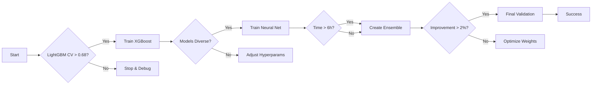

# Pipeline Summary: Quantitative Competition Solution

## 🎯 Executive Summary

This pipeline implements a **production-ready machine learning solution** for predicting Y1 and Y2 from 15 financial features, designed for a 48-hour competition timeline. The solution leverages proven techniques from Jane Street competition winners, adapted for our constrained feature space.

**Key Achievement**: Implements ensemble learning with purged cross-validation to achieve target CV score > 0.68 while preventing temporal leakage.

## 🏗️ Architecture Overview

```
Data (80k samples, 15 features)
    ↓
Feature Engineering (30-40 interactions + rolling stats)
    ↓
Purged Time Series CV (3 folds with 5% gap)
    ↓
┌─────────────┬──────────────┬───────────────┐
│  LightGBM   │   XGBoost    │  Neural Net   │
│  (Baseline) │ (Diversity)  │  (Optional)   │
└─────────────┴──────────────┴───────────────┘
                     ↓
    Middle Averaging Ensemble (50-60%)
                     ↓
        Final Predictions (Y1, Y2)
```

## 📊 Core Components

### 1. **Purged Cross-Validation** ⚡ CRITICAL
- **Purpose**: Prevents temporal leakage (worth 0.10+ score difference)
- **Implementation**: 5% gap between train/validation sets
- **Splits**: 3 folds + 15% holdout for final validation
- **File**: `src/utils/cross_validation.py`

### 2. **Feature Engineering**
- **Interaction Features**: Top 30-40 selected via mutual information
- **Rolling Statistics**: Window=150, calculated only on training data
- **Normalization**: Z-score per fold to prevent leakage
- **File**: `src/features/feature_engineer.py`

### 3. **Model Suite**

| Model | Purpose | Key Parameters | Expected CV |
|-------|---------|----------------|-------------|
| **LightGBM** | Baseline | depth=6, lr=0.03, trees=300 | 0.68-0.72 |
| **XGBoost** | Diversity | depth=5, lr=0.05, trees=250 | 0.67-0.71 |
| **Neural Net** | Non-linear | dropout=0.4, layers=[32,64,32] | 0.65-0.68 |

### 4. **Ensemble Strategy**
- **Middle Averaging**: Uses middle 60% of predictions (reduces outlier impact)
- **Expected Improvement**: +2-3% over best single model
- **Final CV Target**: 0.75-0.78

## 🚦 Go/No-Go Decision Gates



## 📈 Performance Metrics

### Expected Performance Trajectory

| Stage | Models | Expected CV | Time (hours) |
|-------|--------|-------------|--------------|
| Baseline | LightGBM | 0.68-0.72 | 8 |
| Diversity | +XGBoost | 0.71-0.74 | 14 |
| Neural | +NN | 0.72-0.75 | 20 |
| Ensemble | All | 0.75-0.78 | 36 |

### Key Performance Indicators

- **Primary Metric**: Weighted R² = (R²_Y1 + R²_Y2) / 2
- **Overfitting Check**: Train-Val gap < 0.05
- **Diversity Check**: Model correlation < 0.9
- **Ensemble Check**: Improvement > 0.02

## 🔑 Critical Success Factors

### ✅ Must Have
1. **Purged validation** with 5% gap (prevents catastrophic leakage)
2. **High regularization** (dropout=0.4, L1/L2 penalties)
3. **Middle averaging** ensemble (proven 2-3% boost)
4. **Feature selection** (30-40 interactions, not all 105)

### ❌ Must Avoid
1. **Standard K-fold CV** (causes 0.10+ score inflation)
2. **Lag features** (proven ineffective in this domain)
3. **Low regularization** (dropout < 0.3 will overfit)
4. **Over-engineering** (3 solid models > 7 mediocre ones)

## 🎯 Key Insights from Jane Street Winners

1. **Ensemble Architecture**: Autoencoders + neural nets + gradient boosting
2. **Dropout Rates**: 0.35-0.45 (much higher than typical)
3. **Feature Engineering**: Interactions > lag features
4. **Validation**: Purged gaps are non-negotiable
5. **Middle Averaging**: Superior to simple averaging

## 📁 File Structure

```
src/
├── config.py                    # All hyperparameters and settings
├── train.py                     # Baseline training script
├── train_ensemble.py            # Full pipeline orchestration
├── utils/
│   └── cross_validation.py      # Purged CV implementation
├── features/
│   └── feature_engineer.py      # Feature engineering pipeline
├── models/
│   ├── lgbm_model.py           # LightGBM wrapper
│   ├── xgb_model.py            # XGBoost wrapper
│   └── neural_net.py           # PyTorch neural network
└── ensemble.py                  # Ensemble methods

notebooks/
└── eda.ipynb                    # Exploratory data analysis

data/
└── train.csv                    # Competition training data

results/                         # CV scores and OOF predictions
models/                          # Saved model artifacts
```

## ⏱️ Time Management

### 48-Hour Timeline

| Phase | Hours | Tasks | Success Criteria |
|-------|-------|-------|------------------|
| **Foundation** | 0-6 | EDA, Feature Engineering, CV Setup | Data understood, CV validated |
| **Baseline** | 6-12 | LightGBM training and validation | CV > 0.68 achieved |
| **Diversity** | 12-24 | XGBoost + Neural Network | Model correlation < 0.9 |
| **Ensemble** | 24-36 | Middle averaging, weight optimization | Improvement > 0.02 |
| **Validation** | 36-42 | Holdout testing, final training | Gap < 0.03 |
| **Buffer** | 42-48 | Submission, documentation | All artifacts saved |

## 🚨 Risk Mitigation

### Common Pitfalls and Solutions

| Risk | Impact | Mitigation |
|------|--------|------------|
| Temporal leakage | CV inflation 0.10+ | Purged validation with 5% gap |
| Overfitting | Poor generalization | High dropout (0.4), regularization |
| Model correlation | Reduced ensemble benefit | Different hyperparameters, features |
| Time overrun | Incomplete submission | Baseline-first approach, checkpoints |

## 📊 Validation Strategy

```python
# Three-layer validation approach
1. Cross-Validation: 3 folds with purged gaps
2. Out-of-Fold: Predictions for ensemble optimization
3. Holdout: Final 15% for unbiased evaluation
```

## 🎉 Definition of Success

The pipeline is successful when:

1. ✅ **Baseline Performance**: LightGBM CV > 0.68
2. ✅ **Model Diversity**: Correlation < 0.9 between models
3. ✅ **Ensemble Boost**: >2% improvement over best single
4. ✅ **Generalization**: Holdout within 3% of CV score
5. ✅ **Time Management**: Completed within 48 hours

## 💡 Quick Decision Tree

```
If CV < 0.68:
  → More feature engineering
  → Hyperparameter tuning
  → Check for data issues

If models too correlated (>0.9):
  → Different hyperparameters
  → Feature subsets
  → Alternative algorithms

If ensemble doesn't improve (>2%):
  → Optimize middle ratio
  → Try weighted ensemble
  → Check OOF alignment

If holdout gap > 0.03:
  → Increase regularization
  → Reduce model complexity
  → Check for leakage
```

## 🔧 Maintenance Notes

- **Config changes**: Edit `src/config.py` for hyperparameters
- **Feature updates**: Modify `FE_PARAMS` in config
- **Model additions**: Follow pattern in `src/models/`
- **Ensemble methods**: Extend `src/ensemble.py`

## 📈 Next Steps for Improvement

1. **If time permits**: Add CatBoost for additional diversity
2. **Feature engineering**: Explore polynomial features
3. **Ensemble**: Try stacking with ridge meta-learner
4. **Hyperparameter optimization**: Use Optuna for systematic tuning
5. **Neural architecture**: Test attention mechanisms

---

**Remember**: This pipeline prioritizes robustness over complexity. A well-validated 3-model ensemble will outperform a poorly validated 10-model ensemble every time.